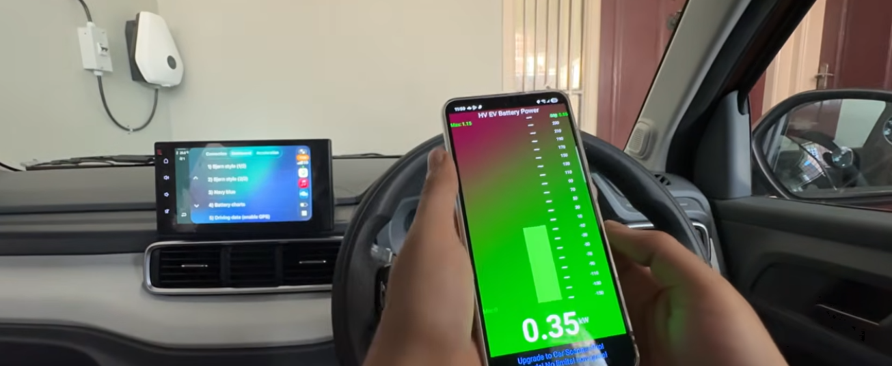

# 

# EV Battery Failure Prediction

## Background

The project aims to analyse the electric vehicle battery degradation and risks. With the increased production and sales of EVs (electric vehicles) and the high costs of a battery care is important to monitor degradation mechanisms in the battery and developing a prognostic models to predict its health is very vital. The idea is to be able to always be forecasting what is likely to happen over time, independent of any specific treatment.

## Data set content.

For this project the data source Kaggle.
The dataset tells us details about the chemistry, manufacturer, vehicle model and a series of readings gather about the state of the battery including a state of health failure risk and degradation category. We assume the health failure risk and degradation state have been provided by something that understands the factors already. The aim of the project is to bring together those factors to a risk matrix to evaluate what those state might be given the raw data. From this machine learning could be used to train a prognostic models to predict its health and risk factor.

## Business requirements and goals

Public safety to be able to quickly predict a battery state of health / degradation (long-term wear) alongside sudden failure risk (thermal runaway, internal short circuits, or sudden cell breakdown).
The vechicle safety standard authorities wish to finds positive coefficients in any of the data available to tell them which features identify issues and specifically leading to risks of failure.
The manufacturer has a business requirements are the find which features can lead to accelerated degradation, they may want to improve the chemistry or materials used that contribute to the degradation.

## What answers am I looking for from the dataset?

### Hypotheses:

**Hypothesis 1 ($H_1$)**: Internal Degradation & Resistance (Degradation Category) Long-term physical wear metrics—specifically capacity_fade_pct, internal_resistance_mohm, total_energy_throughput_kwh, and cycle_count—will be the strongest predictors of the long-term degradation_category."Why: As batteries age, continuous chemical oxidation increases internal resistance and reduces total holding capacity. These are steady, cumulative metrics.

**Hypothesis 2 ($H_2$)**: Stress Factors & Thermal Anomaly Spikes (Failure Risk Label) Operational stress spikes—specifically peak_temp_during_fast_charge_c, fast_charge_ratio, and high avg_ambient_temp_c—will be the primary drivers for predicting sudden failure_risk_label (e.g., Critical risk)."Why: A battery might have low overall wear (Normal degradation), but frequent fast charging in hot climates causes extreme thermal stress, leading to immediate high failure risk (like short circuits or cell swelling).

**Hypothesis 3 ($H_3$)**: Environmental & Usage Acceleration"Harsh operating conditions (high avg_depth_of_discharge_pct, high altitude_m, and extreme climate_zone temperatures) will accelerate the transition speed from Normal to Accelerated degradation."Why: Deep discharging and extreme temperatures degrade the internal battery chemistry faster than gentle usage cycles.

**Null Hypothesis ($H_0$)**: Irrelevant or Redundant Administrative Features: Static metadata and administrative features—specifically bms_firmware_version, service_count, vehicle_model, manufacturer, and date timestamps—will have no direct physical impact on battery failure or degradation."Why: While firmware or manufacturing batches can sometimes correlate with defects, raw administrative labels like vehicle_model or last_service_date do not directly cause electrochemical failure but some of the vehicle model may degrade the same type of battery more than others.

## Deployment Reminders

- The `.python-version`, `.slugignore`, `Procfile` and `setup.sh` files are necessary only if you are deploying a Streamlit app to Heroku as part of your submission for units 2 and 3.
- Set the `.python-version` Python version to a [Heroku-22](https://devcenter.heroku.com/articles/python-support#supported-runtimes) stack, currently supported version that most closely matches what you used in this project.
- The project can be deployed to Heroku using the following steps.

1. Log in to Heroku and create an App
2. At the **Deploy** tab, select **GitHub** as the deployment method.
3. Select your repository name and click **Search**. Once it is found, click **Connect**.
4. Select the branch you want to deploy, then click **Deploy Branch**.
5. The deployment process should happen smoothly if all deployment files are fully functional. Click the button **Open App** at the top of the page to access your App.
6. If the slug size is too large, then add large files not required for the app to the `.slugignore` file.
